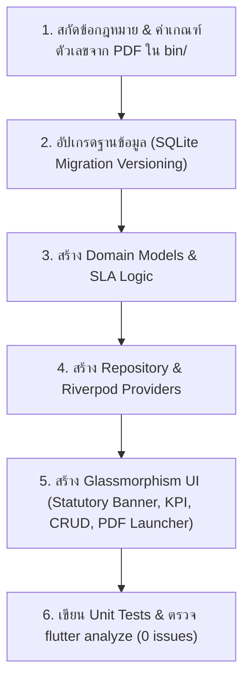

# Thai EHS Statutory Compliance & Module Builder

## Overview
This skill provides the authoritative engineering protocol for building and extending Thai statutory safety modules in the Safapp platform. It encapsulates lessons learned from implementing Thai Ministerial Regulations on Fire Evacuation (สปร.๔), Electrical Safety (แบบ ๕๖๒๘๙ & LOTO), and Machinery/Cranes/Boilers (แบบ ปจ.๑ / ปจ.๒ / Load Test ๑๒๕%).

## Key Statutory Regulations & Forms Mapped

| Domain | Thai Ministerial Regulation | Official Forms & Key Standards | Statutory Testing Criteria |
|---|---|---|---|
| **เครื่องจักร ปั้นจั่น หม้อน้ำ** | กฎกระทรวงเครื่องจักร ปั้นจั่น หม้อน้ำ พ.ศ. ๒๕๖๔ | แบบ ปจ.๑ (อยู่กับที่), แบบ ปจ.๒ (เคลื่อนที่) | • รอบตรวจ: >50T (3 เดือน), 3-50T (6 เดือน), 1-3T (1 ปี) • Load Test: 125% ของพิกัดยก (SWL) • หม้อน้ำ: Hydrostatic test 1.5x MAWP |
| **ระบบไฟฟ้า & LOTO** | กฎกระทรวงความปลอดภัยไฟฟ้า พ.ศ. ๒๕๕๘ | แบบ ๕๖๒๘๙ (ตรวจรับรองประจำปี กสร. ม.๑๒), LOTO (ข้อ ๒๐) | • ตรวจรับรองปีละ ๑ ครั้ง (ยื่น กสร. ใน 30 วัน) • หลักดิน: ความต้านทานไม่เกิน ๕.๐ โอห์ม (≤ 5Ω) • Zero Energy Verification (0 Volt) |
| **อัคคีภัย & หนีไฟ** | กฎกระทรวงป้องกันและระงับอัคคีภัย พ.ศ. ๒๕๕๕ | แบบ สปร.๔ (รายงานผลการฝึกซ้อมดับเพลิงและอพยพหนีไฟ) | • โควตาอบรมดับเพลิงขั้นต้น ≥ 40% ของพนักงาน • ซ้อมหนีไฟปีละ ๑ ครั้ง • ส่ง สปร.๔ ภายใน ๓๐ วัน |
| **ที่อับอากาศ** | กฎกระทรวงความปลอดภัยที่อับอากาศ พ.ศ. ๒๕๖๒ | แบบขออนุญาตเข้าทำงานในที่อับอากาศ | • ๔ ผู้: ผู้อนุญาต, ผู้ควบคุม, ผู้ช่วยเหลือ, ผู้ปฏิบัติงาน • วัดระดับก๊าซ O2 (19.5-23.5%), LEL < 10%, Toxic |
| **นั่งร้าน & ที่สูง** | กฎกระทรวงนั่งร้าน พ.ศ. ๒๕๖๔ | Scaffolding Inspection Tag (เขียว/เหลือง/แดง) | • งานสูง > 2 เมตรต้องใช้อุปกรณ์กันตก Full Body Harness • ตรวจสภาพนั่งร้านทุก ๗ วัน และหลังฝนตกหนัก |

---

## Standard Module Implementation Workflow

### Step 1: Database Migration Protocol
1. Increment DB version in `lib/core/database/database_helper.dart` (e.g., version 14).
2. Wire creation methods into `_onCreate`, `_onUpgrade` (for `oldVersion < N`), and `_onOpen`.
3. Always create database indices for `tag`, `inspection_date`, and `expiry_date`.
4. Always auto-seed realistic, legally compliant factory default equipment on initial launch.

### Step 2: Domain Model & Statutory SLA
Each statutory inspection model must calculate:
- `daysUntilExpiry`: difference between expiry date and today.
- `slaStatus`:
  - `OVERDUE`: `daysUntilExpiry < 0` (Red warning badge)
  - `WARNING`: `0 <= daysUntilExpiry <= 30` (Amber caution badge)
  - `COMPLIANT`: `daysUntilExpiry > 30` (Green safe badge)
- File paths for digital evidence: Contractor report (PDF), testing certificates (PDF), and Engineer's professional license (ใบอนุญาต กว. / ม.๙ / ม.๑๑).

### Step 3: UI Conventions
- **Banner**: Include a prominent Statutory Mandate Banner citing the specific Ministerial Regulation, year, and clause.
- **KPI Summary Cards**: Total units, Compliant, Warning (30-day notice), Overdue.
- **1-Click Document Launchers**: Open attached PDF files directly with native OS viewer (`cmd.exe /c start` on Windows).
- **Responsive Layout**: Use `Wrap` and `LayoutBuilder` with min-width bounds to prevent RenderFlex overflow.

---

## Verification Protocol
1. Run targeted analyzer: `flutter analyze lib/features/<module_name>` to ensure 0 errors and 0 warnings.
2. Run targeted tests: `flutter test test/features/<module_name>/`.
3. Verify database initialization and sample seeds render properly.
