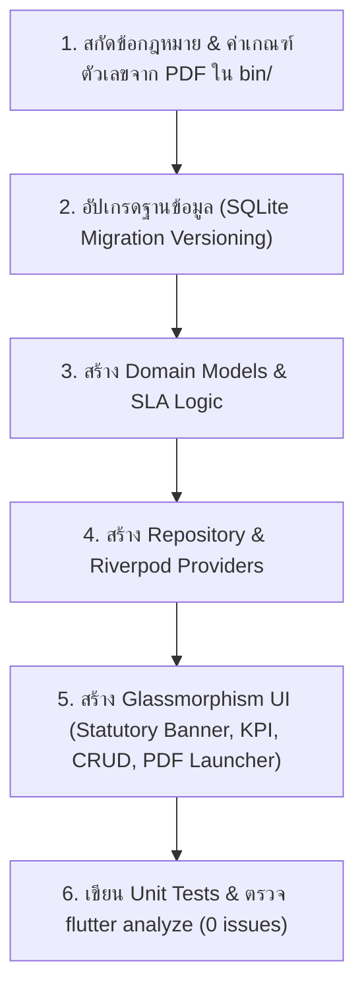

# Thai EHS Statutory Compliance & Module Builder

## Overview
This skill provides the authoritative engineering protocol for building and extending Thai statutory safety modules in the Safapp platform. It encapsulates lessons learned from implementing Thai Ministerial Regulations on Fire Evacuation (สปร.๔), Electrical Safety (แบบ ๕๖๒๘๙ & LOTO), and Machinery/Cranes/Boilers (แบบ ปจ.๑ / ปจ.๒ / Load Test ๑๒๕%).

## Key Statutory Regulations & Forms Mapped

| Domain | Thai Ministerial Regulation | Official Forms & Key Standards | Statutory Testing Criteria |
|---|---|---|---|
| **เครื่องจักร ปั้นจั่น หม้อน้ำ** | กฎกระทรวงเครื่องจักร ปั้นจั่น หม้อน้ำ พ.ศ. ๒๕๖๔ | แบบ ปจ.๑ (อยู่กับที่), แบบ ปจ.๒ (เคลื่อนที่) | • รอบตรวจ: >50T (3 เดือน), 3-50T (6 เดือน), 1-3T (1 ปี) • Load Test: 125% ของพิกัดยก (SWL) • หม้อน้ำ: Hydrostatic test 1.5x MAWP |
| **ระบบไฟฟ้า & LOTO** | กฎกระทรวงความปลอดภัยไฟฟ้า พ.ศ. ๒๕๕๘ | แบบ ๕๖๒๘๙ (ตรวจรับรองประจำปี กสร. ม.๑๒), LOTO (ข้อ ๒๐) | • ตรวจรับรองปีละ ๑ ครั้ง (ยื่น กสร. ใน 30 วัน) • หลักดิน: ความต้านทานไม่เกิน ๕.๐ โอห์ม (≤ 5Ω) • Zero Energy Verification (0 Volt) |
| **อัคคีภัย & หนีไฟ** | กฎกระทรวงป้องกันและระงับอัคคีภัย พ.ศ. ๒๕๕๕ | แบบ สปร.๔ (รายงานผลการฝึกซ้อมดับเพลิงและอพยพหนีไฟ) | • โควตาอบรมดับเพลิงขั้นต้น ≥ 40% ของพนักงาน • ซ้อมหนีไฟปีละ ๑ ครั้ง • ส่ง สปร.๔ ภายใน ๓๐ วัน |
| **ที่อับอากาศ** | กฎกระทรวงความปลอดภัยที่อับอากาศ พ.ศ. ๒๕๖๒ | แบบขออนุญาตเข้าทำงานในที่อับอากาศ | • ๔ ผู้: ผู้อนุญาต, ผู้ควบคุม, ผู้ช่วยเหลือ, ผู้ปฏิบัติงาน • วัดระดับก๊าซ O2 (19.5-23.5%), LEL < 10%, Toxic |
| **นั่งร้าน & ที่สูง** | กฎกระทรวงนั่งร้าน พ.ศ. ๒๕๖๔ | Scaffolding Inspection Tag (เขียว/เหลือง/แดง) | • งานสูง > 2 เมตรต้องใช้อุปกรณ์กันตก Full Body Harness • ตรวจสภาพนั่งร้านทุก ๗ วัน และหลังฝนตกหนัก |

---

## Standard Module Implementation Workflow

### Step 1: Database Migration Protocol
1. Increment DB version in `lib/core/database/database_helper.dart` (e.g., version 14).
2. Wire creation methods into `_onCreate`, `_onUpgrade` (for `oldVersion < N`), and `_onOpen`.
3. Always create database indices for `tag`, `inspection_date`, and `expiry_date`.
4. Always auto-seed realistic, legally compliant factory default equipment on initial launch.

### Step 2: Domain Model & Statutory SLA
Each statutory inspection model must calculate:
- `daysUntilExpiry`: difference between expiry date and today.
- `slaStatus`:
  - `OVERDUE`: `daysUntilExpiry < 0` (Red warning badge)
  - `WARNING`: `0 <= daysUntilExpiry <= 30` (Amber caution badge)
  - `COMPLIANT`: `daysUntilExpiry > 30` (Green safe badge)
- File paths for digital evidence: Contractor report (PDF), testing certificates (PDF), and Engineer's professional license (ใบอนุญาต กว. / ม.๙ / ม.๑๑).

### Step 3: UI Conventions
- **Banner**: Include a prominent Statutory Mandate Banner citing the specific Ministerial Regulation, year, and clause.
- **KPI Summary Cards**: Total units, Compliant, Warning (30-day notice), Overdue.
- **1-Click Document Launchers**: Open attached PDF files directly with native OS viewer (`cmd.exe /c start` on Windows).
- **Responsive Layout**: Use `Wrap` and `LayoutBuilder` with min-width bounds to prevent RenderFlex overflow.

### Step 4: Digital SOP (Standard Operating Procedure) Engineering Protocol
Every statutory domain must support actionable SOPs adhering to ISO 45001 Clause 7.5:
1. **Identification**: SOP Code (`SOP-[DOMAIN]-[SEQ]`), Title (TH/EN), Domain Category, Revision, Effective Date, Review SLA.
2. **Prerequisites & Safeguards**: Mandatory PPE selection (Visual badges), Operator Qualifications (e.g. กว., ๔ ผู้, ช่างไฟฟ้า), Critical Hazards & Golden Safety Rules.
3. **Structured 3-Phase Procedures**:
   - Phase A: Pre-Operational Checks (เตรียมการ & ตรวจสอบก่อนเริ่มงาน)
   - Phase B: Operational Execution (ขั้นตอนปฏิบัติงานหลัก + จุดตรวจความปลอดภัย Safety Checkpoint)
   - Phase C: Post-Operational / Restoration (การเก็บกู้ คืนสภาพ และส่งมอบงาน)
4. **Emergency Protocols**: E-Stop actions, spill kits, eyewash, first-aid measures.
5. **Dual-Mode Integration**: Retain in-app structured viewer/editor while supporting native external PDF viewing.

### Step 5: 3-Tier Safety Manual & Dynamic Handbook Assembly Protocol
Under Thai Ministerial Regulations B.E. 2565 and OSH Act B.E. 2554 (Section 13), employers must provide written safety regulations and manuals distributed to all employees:
1. **Tier 1 - Master Safety Manual (เล่มรวมแม่แบบ ๑๒-๑๕ บท)**:
   - Full chapters: Policy, Committee (คปอ.), General Rules, PPE Matrix, PTW, Dynamic Hazard Modules, Incident Reporting, Emergency Response.
2. **Tier 2 - Employee Pocket Handbook (คู่มือฉบับพนักงาน/กระเป๋าเสื้อ)**:
   - Frontline focus: Worker Rights & Duties, 10 Golden Rules, Safety Signs & Colors, Department PPE, Stop Work Authority, Emergency Hotline.
3. **Tier 3 - 1-Page Safety Induction Leaflet (ใบสรุปพนักงานใหม่ ๑ หน้า)**:
   - Essential site rules, PPE requirements, evacuation route, alarms, and Tear-off Sign-off acknowledgment slip.
4. **Dynamic Factory Scope Synthesis**:
   - Centralized scope configuration flags (`hasBoiler`, `hasCrane`, `hasChemical`, `hasConfinedSpace`, `hasHeights`, `hasElectrical`, `hasEmergency`).
   - Dynamically includes or suppresses specific hazard chapters across all 3 tiers without manual rewrite.

### Step 6: Statutory Safety Management System (SMS 2565) Audit & Cross-Module Verification Protocol
Under Thai Ministerial Regulation on Safety Management Systems B.E. 2565 (กฎกระทรวงระบบการจัดการด้านความปลอดภัย พ.ศ. ๒๕๖๕, ๑๑ เม.ย. ๒๕๖๕) issued under OSH Act B.E. 2554 (Sections 5 & 8):
1. **Mandatory Scope (ข้อ ๔ & บัญชีท้าย ๕๔ กิจการ)**:
   - Covers 54 scheduled industries with 50+ employees (within 60 days of reaching employee threshold).
   - Equivalency recognition (ข้อ ๑๓): ISO 45001, ILO-OSH, OSHA, ANSI, BSI, AS/NZS, CSA.
2. **5 Core Statutory Pillars (ข้อ ๕-๑๑)**:
   - Pillar 1: Safety Policy & Employee Participation (นโยบายด้านความปลอดภัยฯ ข้อ ๖-๗) - Written in Thai, signed, reviewed annually.
   - Pillar 2: Safety Organization & Contractor Safety (การจัดองค์กรด้านความปลอดภัยฯ ข้อ ๘) - Certified roles (จป./คปอ.), training, 2-year document retention (ข้อ ๘(๓)).
   - Pillar 3: Planning & Implementation (แผนงานด้านความปลอดภัยและการนำไปปฏิบัติ ข้อ ๙) - Initial hazard review, defined budgets, SLAs, and evaluation metrics.
   - Pillar 4: Performance Evaluation & Annual Review (การประเมินผลและการทบทวนระบบ ข้อ ๑๐) - Internal Safety Audit (ข้อ ๑๐(๑)), 5W1H incident analysis (ข้อ ๑๐(๒)), annual systemic review.
   - Pillar 5: Continual Improvement & Worker Engagement (การปรับปรุงและพัฒนา ข้อ ๑๑-๑๒) - Continuous CAPA closed-loop, worker feedback/whistleblower channels.
3. **Cross-Module Evidence Engine**:
   - Automatically gathers live verification metrics from across active modules (`electrical`, `machinery`, `chemicals`, `environment`, `ptw`, `emergency`, `health_hygiene`, `cpo`).
   - Links direct inspection records (แบบ ๕๖๒๘๙, ปจ.๑, ปจ.๒, สอ.๑, สอ.๓, สปร.๔) next to audit criteria.
4. **Grading & Statutory CAR/CAPA Engine**:
   - 4-Tier Evaluation: `CONFORM`, `MINOR_NC`, `MAJOR_NC`, `N/A`.
   - Automatic Corrective & Preventive Action (CAR/CAPA) generation upon Non-Conformance detection with root cause analysis and SLA tracking.
5. **Statutory Document Retention & Export**:
   - Produces official bilingual PDF Audit Reports with Auditor, Safety Officer (จป.วิชาชีพ), and Employer signature blocks for Section 8(3) 2-year statutory retention.
   - Produces detailed Excel Compliance Worksheets for Department of Labour Protection and Welfare (สปภ.) inspector verification.

### Step 7: Statutory CPO Election & Committee Unified Architecture Protocol
Under Thai Ministerial Regulation on Safety Officers, Personnel, and Committees B.E. 2565 (กฎกระทรวงการจัดให้มีเจ้าหน้าที่ความปลอดภัยในการทำงาน บุคลากร หน่วยงาน หรือคณะบุคคลเพื่อดำเนินการด้านความปลอดภัยในสถานประกอบกิจการ พ.ศ. ๒๕๖๕, หมวด ๓ ข้อ ๒๓-๓๒) and Department of Labour Protection and Welfare Manual Form กสร. ๑/๒๕๖๑:

1. **Statutory Quota Thresholds (ข้อ ๒๕)**:
   - Workplace employee thresholds:
     - 50 - 99 employees: ≥ 5 members (Employer Rep: 2, Employee Rep: 2, Secretary: 1)
     - 100 - 499 employees: ≥ 7 members (Employer Rep: 3, Employee Rep: 3, Secretary: 1)
     - ≥ 500 employees: ≥ 11 members (Employer Rep: 5, Employee Rep: 5, Secretary: 1)
   - Chairperson (ประธาน คปอ.): Employer or Executive Management representative.
   - Parity Principle: Employer representatives and elected Employee representatives must be strictly equal in count.

2. **Election Committee (กกต. เฉพาะกิจ) & Ballot Lifecycle (ข้อ ๒๖-๒๗)**:
   - Election Committee consists of at least 3-5 appointed employees to organize, oversee, and supervise the election.
   - 5 Statutory Milestone Cards:
     - Card 1: Election Committee Setup (กกต.)
     - Card 2: Candidate Nomination & Screening (ผู้สมัครรับเลือกตั้ง)
     - Card 3: Secret Ballot Voting & Official Tally (ลงคะแนน & นับคะแนน)
     - Card 4: Overrideable Certification Dialog (สรุปผล & รับรองผล กกต. พร้อมแก้ไขคะแนนและสถานะ คปอ. อิสระ)
     - Card 5: Official Announcement (ประกาศ กกต. ภาษาไทยคมชัด) & Auto-Transfer to CPO Committee.

3. **Cross-Module Safety Officer Integration (SMS Context จป. -> เลขานุการ คปอ.)**:
   - Under Section 25(4), the Secretary must be the Professional Safety Officer (จป.วิชาชีพ) or an authorized designee.
   - **Auto-Pull Protocol**: Automatically query `CompanyProfile` from the Organization module (SMS Context):
     - Safely extract `safetyOfficerName`, `safetyOfficerLevel`, and `safetyOfficerPhone`.
     - Provide a 1-click auto-assign button `[⚡ ดึงอัตโนมัติจาก จป. ในโมดูลองค์กร]` to register the Secretary into SQLite instantly.
     - Provide seamless manual fallback: allow editing, custom text input, or selecting any employee from the 69-person employee registry.

4. **Unified Term-Round Architecture (การหลอมรวมการ์ด คปอ. เข้ากับรอบการเลือกตั้ง)**:
   - Avoid creating disjointed, standalone committee tabs that disconnect members from their originating election.
   - Instead, embed the 4 statutory committee groups (ประธาน, ผู้แทนนายจ้าง, ผู้แทนลูกจ้างจากรอบนี้, เลขานุการ) directly inside the active Election Round card view.
   - This provides immediate end-to-end statutory audit traceability: auditors can verify the exact election round, vote tally, and กกต. announcement that formed the 2-year committee term.

---

## Verification Protocol
1. Run targeted analyzer: `flutter analyze lib/features/<module_name>` to ensure 0 errors and 0 warnings.
2. Run targeted tests: `flutter test test/features/<module_name>/`.
3. Verify database initialization and sample seeds render properly.
